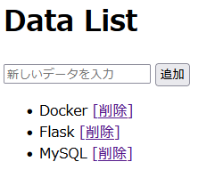

# Docker Composeを用いたWeb+DBの2コンテナ構成環境の構築

## はじめに

この手順書は、Webとデータベースを繋げた環境をDocker Composeを用いて構築することが目的です。

http://127.0.0.1:5000/ にアクセスすると、データベースを操作可能な簡易的なWebアプリが表示されることを完成とします。

## 1.前提条件

・実行環境: Ubuntu 22.04.5 LTS

windowsで実行している方は
[こちら](https://learn.microsoft.com/ja-jp/windows/wsl/install)を参照してインストールしてください。

## 2.dockerのインストール

### 2.1 dockerのインストールのためのコマンド

```bash
for pkg in docker.io docker-doc docker-compose docker-compose-v2 podman-docker containerd runc; do sudo apt-get remove $pkg; done
```

古いバージョンや競合する可能性のあるパッケージを削除します。

```bash
sudo apt-get update
```

パッケージリストを最新の状態にします。

```bash
sudo apt-get install ca-certificates curl
```

curlコマンドをインストールします。

```bash
sudo install -m 0755 -d /etc/apt/keyrings
```

公式のGPGキーを保存するフォルダを作成し、権限を追加します。

```bash
sudo curl -fsSL https://download.docker.com/linux/ubuntu/gpg -o /etc/apt/keyrings/docker.asc
```

Dockerの公式サイトからGPGキーをインストールします。

```bash
sudo chmod a+r /etc/apt/keyrings/docker.asc
```

保存したGPGキーに読み取り権限を付与します。

```bash
echo \
  "deb [arch=$(dpkg --print-architecture) signed-by=/etc/apt/keyrings/docker.asc] https://download.docker.com/linux/ubuntu \
  $(. /etc/os-release && echo "$VERSION_CODENAME") stable" | \
  sudo tee /etc/apt/sources.list.d/docker.list > /dev/null
```

リポジトリに公式のDockerリポジトリを追加します。

```bash
sudo apt-get update
```

改めてパッケージリストを最新の状態にします。

```bash
sudo apt-get install docker-ce docker-ce-cli containerd.io docker-buildx-plugin docker-compose-plugin
```

docker関係のツールをまとめてインストールします。

### 動作確認

```bash
sudo docker run hello-world
```

docker公式のテストプログラムです。\
`Hello from Docker!`というログが確認出来たらOKです。

### 2.2 権限の設定

通常、dockerコマンドの実行にはsudoが必要になりますが、sudoなしで実行できるようにします。

```bash
sudo usermod -aG docker $USER
```

現在のユーザーをdockerグループに追加します。

```bash
newgrp docker
```

設定を反映します。

### 動作確認

```bash
docker run hello-world
```

先ほどのテストプログラムをsudo抜きで実行してみます。\
`Hello from Docker!`というログが確認出来たらOKです。

## 3.プロジェクト作成

インストールが完了したので、プロジェクトを作成します。\
今回は、`my-web-app`というフォルダ名で説明します。\

### 3.1 フォルダ作成

次の構成のフォルダを作成してください。

```
my-web-app/
├── compose.yml
├── app/
│   ├── Dockerfile
│   ├── requirements.txt
│   ├── main.py
│   └── templates/
│       └── index.html
└── mysql/
    └── init.sql

```

### 3.2 ファイル設定

各ファイルの中身を説明します。

`compose.yml`

```yaml
services:
  db:
    image: mysql:8.0
    restart: always
    environment:
      MYSQL_DATABASE: myappdb
      MYSQL_ROOT_PASSWORD: password
    volumes:
      - ./mysql/init.sql:/docker-entrypoint-initdb.d/init.sql
    healthcheck:
      test:
        [
          "CMD",
          "mysqladmin",
          "ping",
          "-h",
          "localhost",
          "-u",
          "root",
          "-ppassword",
        ]
      interval: 5s
      timeout: 5s
      retries: 10
    ports:
      - "3306:3306"

  app:
    build: ./app
    volumes:
      - ./app:/app
    ports:
      - "5000:5000"
    environment:
      - DB_HOST=db
      - DB_NAME=myappdb
      - DB_USER=root
      - DB_PASS=password
    depends_on:
      db:
        condition: service_healthy
```

データベースとアプリの二つのコンテナを連携させて起動するためのファイルです。\
`db`の中身で`MySQL`を使用したデータベースを作成しています。\
そして、`app`の中身でappフォルダにあるDockerfileを基にbuildします。\
また、`depends_on`の中身を書き込むことでデータベースの準備が完了してからアプリを起動するようにしています。こうすることで、準備中のデータベースにアクセスしてエラーになることを防いでいます。

`app/Dockerfile`

```dockerfile
FROM python:3.11-slim

WORKDIR /app

RUN apt-get update && apt-get install -y \
    gcc \
    default-libmysqlclient-dev \
    pkg-config \
    && rm -rf /var/lib/apt/lists/*

COPY requirements.txt .
RUN pip install --no-cache-dir -r requirements.txt

COPY . .

CMD ["python", "main.py"]
```

python3.11をベースにして、アプリの実行に必要なライブラリ等をインストールし、アプリを立ち上げるためのファイルです。

`app/requirements.txt`

```txt
flask
mysqlclient
flask-sqlalchemy
```

`Dockerfile`でインストールするライブラリを書いておくファイルです。

`app/main.py`

```python
from flask import Flask, render_template, request, redirect
from flask_sqlalchemy import SQLAlchemy
import os

app = Flask(__name__)

db_uri = f"mysql://{os.getenv('DB_USER')}:{os.getenv('DB_PASS')}@{os.getenv('DB_HOST')}/{os.getenv('DB_NAME')}"
app.config['SQLALCHEMY_DATABASE_URI'] = db_uri
db = SQLAlchemy(app)

class Task(db.Model):
    id = db.Column(db.Integer, primary_key=True)
    content = db.Column(db.String(200), nullable=False)

with app.app_context():
    db.create_all()

@app.route('/')
def index():
    tasks = Task.query.all()
    return render_template('index.html', tasks=tasks)

@app.route('/add', methods=['POST'])
def add():
    content = request.form.get('content')
    new_task = Task(content=content)
    db.session.add(new_task)
    db.session.commit()
    return redirect('/')

@app.route('/delete/<int:id>')
def delete(id):
    task = Task.query.get(id)
    db.session.delete(task)
    db.session.commit()
    return redirect('/')

if __name__ == "__main__":
    app.run(host="0.0.0.0", port=5000, debug=True)

```

今回のアプリのバックエンド部分です。データの追加と削除の操作を可能にしています。

`app/templates/index.html`

```html
<!doctype html>
<html>
  <head>
    <title>MySQL CRUD App</title>
  </head>
  <body>
    <h1>Data List</h1>
    <form action="/add" method="POST">
      <input
        type="text"
        name="content"
        placeholder="新しいデータを入力"
        required
      />
      <button type="submit">追加</button>
    </form>
    <ul>
      
      <li>
        {{ task.content }}
        <a href="/delete/{{ task.id }}">[削除]</a>
      </li>
      
    </ul>
  </body>
</html>
```

今回のアプリのフロントエンド部分です。`main.py`で作成した操作を直感的に行うことができます。

`mysql/init.sql`(任意)

```sql
CREATE TABLE IF NOT EXISTS task (
    id INT AUTO_INCREMENT PRIMARY KEY,
    content VARCHAR(200) NOT NULL
);

INSERT INTO task (content) VALUES ('Docker');
INSERT INTO task (content) VALUES ('Flask');
INSERT INTO task (content) VALUES ('MySQL');
```

今回のアプリの初期値を設定します。設定しなくても問題ありません。

## 4.プロジェクト実行

プロジェクト実行のためのコマンドを説明します。

```
docker compose up -d --build
```

docker composeのコンテナ実行用コマンドです。次のようなログが出ればOKです。

```
[+] up 4/4
 ✔ Image my_web_db-app       Built
 ✔ Network my_web_db_default Created
 ✔ Container my_web_db-db-1  Healthy
 ✔ Container my_web_db-app-1 Created
```

二回目以降の実行時は、次のコマンドでOKです。

```
docker compose up -d
```

その後、http://127.0.0.1:5000/ にアクセスすると、次のような画面が出てきます。\
\
これで、Web+DBの2コンテナ構成環境の構築は完了です。

## 5.トラブルシューティング

### 5.1 コンテナが起動しない場合

**症状:** `docker compose up -d` を実行してもコンテナが起動しない

**対処方法:**

次のコマンドを実行してログを確認します。

```
docker compose logs
```

**ポート競合エラー:** 別のプロセスが5000番や3306番ポートを使用している場合

以下のようなエラーログが表示されます。

```
Error response from daemon: Ports are not available: exposing port TCP 0.0.0.0:5000 -> 0.0.0.0:0: bind: address already in use.
```

または

```
Error response from daemon: Ports are not available: exposing port TCP 0.0.0.0:3306 -> 0.0.0.0:0: bind: An attempt was made to access a socket in a way forbidden by its access permissions.
```

**対処方法:**

1.既存のコンテナを停止します。

```
docker compose down
```

2.ポートが実際に使用中か確認します。

Windows環境の場合：

```
netstat -ano | findstr :5000
```

ポートを使用しているプロセスID（PID）が表示されます。そのプロセスを停止してください。

Linux環境の場合：

```
sudo lsof -i :5000
```

プロセスの詳細が表示されるため、不要なプロセスであれば停止してください。

3.コンテナを再度起動します。

```
docker compose up -d
```

### 5.2 データベースに接続できない場合

**症状:** アプリケーションエラーまたは`Can't connect to MySQL server`というエラーが表示される

**対処方法:**

MySQLコンテナが正常に起動しているか確認します。

```
docker compose ps
```

データベースのSTATUSが`healthy`になっていることを確認します。\
なっていない場合、`compose.yml`のDB_HOST, DB_NAME, DB_USER, DB_PASS が正しく設定されているかを確認してください。

### 5.3 Webページが表示されない場合

**症状:** http://127.0.0.1:5000/ にアクセスしても接続できない

**対処方法:**

1 アプリケーションコンテナが起動しているか確認します。

```
docker compose ps app
```

STATUSが`Up`になっていることを確認します。

2.アプリのログを確認します。

```
docker compose logs app
```

Pythonスクリプトでエラーが発生している場合、エラーメッセージが表示されます。

3.ブラウザのキャッシュをクリアしてリロードしてください。

### 5.4 実行し直す場合

エラーに対処してコンテナを実行し直す時は次のコマンドを実行してください。

```
docker compose down -v
docker compose up -d
```

#### 参考資料

https://learn.microsoft.com/ja-jp/windows/wsl/install/
https://docs.docker.com/

作成したファイルは生成AIを参照
